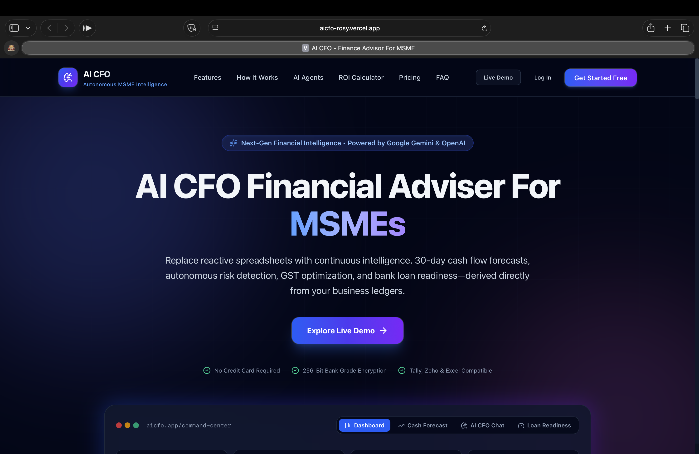

# AI CFO & Financial Advisor for MSMEs

> **An AI-powered financial intelligence and advisory platform designed to help Micro, Small and Medium Enterprises (MSMEs) understand, monitor, and improve their financial health.**

## 🌐 Live Deployment

### 🚀 Live Application

**Frontend / Application:**
https://aicfo-rosy.vercel.app/

## 🔑 Demo Account

Use the following **dummy account** to test the application:

| Field            | Details             |
| ---------------- | ------------------- |
| **Email**        | `me12@gmail.com`    |
| **Password**     | `Mehul@12345`       |
| **Account Type** | Demo / Test Account |

> ⚠️ **Note:** These credentials are for demonstration/testing purposes only. Do not use real or production credentials in this public repository.

## 📸 Application Screenshots

### 🏠 Dashboard



## ✨ Features

* 🔐 User Authentication
* 📊 Financial Dashboard
* ❤️ Financial Health Analysis
* 💳 Transaction Management
* 🧾 Invoice Management
* 💰 Expense Tracking
* 🇮🇳 GST & Tax Management
* 🏦 Loan Management
* 💵 Cash Flow Analysis & Forecasting
* ⚠️ Risk Analysis
* 🏆 Loan Readiness Assessment
* 🤖 AI CFO Assistant
* 💡 Financial Recommendations
* 🔔 Alerts & Notifications
* 📑 Financial Reports
* 🏢 Business Profile

The AI CFO supports **OpenAI, Google Gemini, and deterministic financial calculations as fallback**.

## 🤖 AI Configuration

### OpenAI

```env
LLM_PROVIDER=openai
OPENAI_API_KEY=your_api_key
OPENAI_MODEL=gpt-4.1-mini
```

### Gemini

```env
LLM_PROVIDER=gemini
GEMINI_API_KEY=your_api_key
GEMINI_MODEL=gemini-3.6-flash
```

AI keys must be configured **only in the backend**.

---

## 🔒 Security

* Environment-based secrets
* Protected authentication routes
* Token-based authentication
* API validation
* CORS protection
* HTTPS in production
* AWS SSM Parameter Store
* No AI/API keys in frontend

---

## 📚 Documentation

* `QUICK_START.md`
* `LOCAL_LAPTOP_SETUP.md`
* `ARCHITECTURE.md`
* `DEPLOYMENT.md`
* `AI_PROVIDER_SETUP.md`
* `API_DOCUMENTATION.md`

---

## 👨‍💻 Project

**AI CFO & Financial Advisor for MSMEs**

**Type:** AI + FinTech + Full Stack Application
**Frontend:** React + TypeScript
**Backend:** FastAPI + Python
**Database:** MongoDB Atlas
**Cloud:** AWS
**Deployment:** Docker + Terraform + GitHub Actions

---


# 🛠️ Technology Stack

## Frontend

| Technology      | Purpose                 |
| --------------- | ----------------------- |
| React 19        | UI development          |
| Vite 7          | Build tool              |
| TypeScript      | Type-safe development   |
| Tailwind CSS    | Styling                 |
| Axios           | HTTP requests           |
| TanStack Query  | Server-state management |
| React Hook Form | Form management         |
| Zod             | Validation              |
| React Router    | Routing                 |
| Recharts        | Data visualization      |
| Lucide React    | Icons                   |
| Framer Motion   | Animations              |
| date-fns        | Date handling           |
| react-markdown  | AI response formatting  |

---

## Backend

| Technology                 | Purpose              |
| -------------------------- | -------------------- |
| Python                     | Backend programming  |
| FastAPI                    | REST API framework   |
| MongoDB                    | Database             |
| MongoDB Atlas              | Cloud database       |
| JWT / Token Authentication | Authentication       |
| OpenAI                     | Optional AI provider |
| Google Gemini              | Optional AI provider |

---

## DevOps & Cloud

| Technology              | Purpose                             |
| ----------------------- | ----------------------------------- |
| Docker                  | Containerization                    |
| Docker Compose          | Multi-container deployment          |
| AWS EC2                 | Application hosting                 |
| AWS SSM Parameter Store | Secret management                   |
| Terraform               | Infrastructure as Code              |
| GitHub Actions          | CI/CD                               |
| Caddy                   | Frontend web server / reverse proxy |

---

# 🏗️ System Architecture

```text
                         ┌──────────────────────┐
                         │       User           │
                         └──────────┬───────────┘
                                    │
                                    ▼
                         ┌──────────────────────┐
                         │ React + Vite         │
                         │ TypeScript Frontend  │
                         └──────────┬───────────┘
                                    │
                                    │ HTTPS / REST API
                                    ▼
                         ┌──────────────────────┐
                         │ Caddy / Reverse      │
                         │ Proxy                │
                         └──────────┬───────────┘
                                    │
                                    ▼
                         ┌──────────────────────┐
                         │ FastAPI Backend      │
                         │ Python               │
                         └──────────┬───────────┘
                                    │
                 ┌──────────────────┼──────────────────┐
                 │                  │                  │
                 ▼                  ▼                  ▼
        ┌────────────────┐ ┌────────────────┐ ┌────────────────┐
        │ MongoDB Atlas  │ │ AI Providers   │ │ Financial      │
        │ Database       │ │ OpenAI/Gemini  │ │ Logic/Rules    │
        └────────────────┘ └────────────────┘ └────────────────┘
```

---

# 📁 Project Structure

```text
AICFO/
│
├── backend/
│   ├── app/
│   ├── routes/
│   ├── services/
│   ├── models/
│   ├── schemas/
│   ├── utils/
│   ├── .env.example
│   └── requirements.txt
│
├── src/
│   ├── components/
│   ├── contexts/
│   ├── pages/
│   ├── services/
│   ├── lib/
│   ├── utils/
│   ├── App.tsx
│   ├── main.tsx
│   └── index.css
│
├── deploy/
│
├── infra/
│   └── terraform/
│
├── ci/
│   └── deploy.yml
│
├── sample-data/
│
├── .env.example
├── .gitignore
├── Dockerfile
├── docker-compose.prod.yml
├── docker-compose.yml
├── package.json
├── package-lock.json
├── tsconfig.json
├── vite.config.ts
├── ARCHITECTURE.md
├── DEPLOYMENT.md
├── LOCAL_LAPTOP_SETUP.md
├── AI_PROVIDER_SETUP.md
├── API_DOCUMENTATION.md
├── PROJECT_SUMMARY.md
├── QUICK_START.md
└── README.md
```
## ⚙️ Local Setup

### 1. Clone

```bash
git clone <YOUR_GITHUB_REPOSITORY_URL>
cd AICFO
```

### 2. Frontend

```bash
npm install
cp .env.example .env
npm run dev
```

Frontend:

```text
http://localhost:5173
```

### 3. Backend

Open another terminal:

```bash
cd backend
python -m venv venv
```

**Windows:**

```bash
venv\Scripts\activate
```

**macOS/Linux:**

```bash
source venv/bin/activate
```

Install dependencies:

```bash
pip install -r requirements.txt
```

Create environment file:

```bash
cp .env.example .env
```

Run backend:

```bash
uvicorn main:app --reload
```

Backend:

```text
http://localhost:8000
```

Swagger:

```text
http://localhost:8000/docs
```

The project uses separate frontend and backend setup with the frontend API URL configured through `VITE_API_BASE_URL`.

---

## 🍃 MongoDB Atlas

Add your MongoDB connection string to:

```env
MONGODB_URI=your_mongodb_connection_string
DATABASE_NAME=ai_cfo
```

Never commit `.env` or database credentials to GitHub.

---
By Mehul Gajjar 